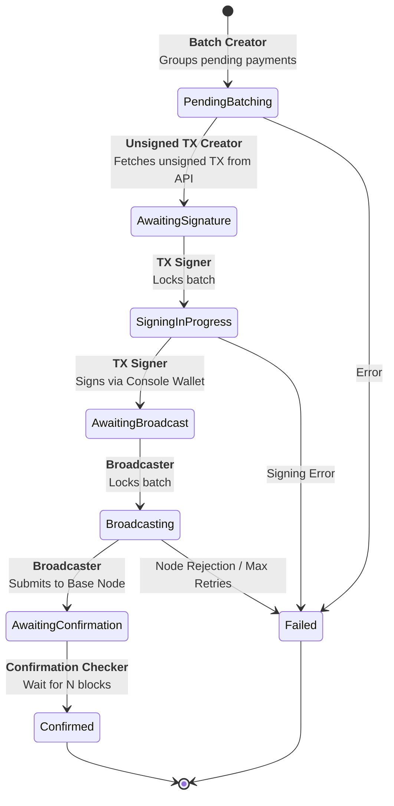

```mermaid
stateDiagram-v2
    [*] --> PendingBatching: <b>Batch Creator</b><br/>Groups pending payments
    
    PendingBatching --> AwaitingSignature: <b>Unsigned TX Creator</b><br/>Fetches unsigned TX from API
    PendingBatching --> Failed: Error
    
    AwaitingSignature --> SigningInProgress: <b>TX Signer</b><br/>Locks batch
    SigningInProgress --> AwaitingBroadcast: <b>TX Signer</b><br/>Signs via Console Wallet
    SigningInProgress --> Failed: Signing Error
    
    AwaitingBroadcast --> Broadcasting: <b>Broadcaster</b><br/>Locks batch
    Broadcasting --> AwaitingConfirmation: <b>Broadcaster</b><br/>Submits to Base Node
    Broadcasting --> Failed: Node Rejection / Max Retries
    
    AwaitingConfirmation --> Confirmed: <b>Confirmation Checker</b><br/>Wait for N blocks
    
    Confirmed --> [*]
    Failed --> [*]
```
