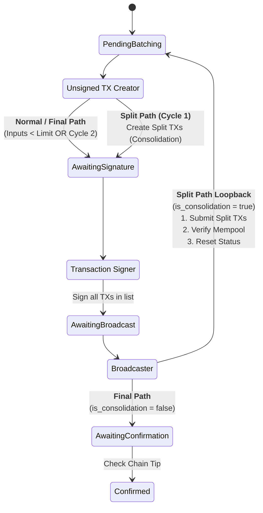

```mermaid
stateDiagram-v2
    [*] --> PendingBatching

    state "Unsigned TX Creator" as UTC
    state "Transaction Signer" as TS
    state "Broadcaster" as BC
    
    PendingBatching --> UTC
    UTC --> AwaitingSignature: <b>Normal / Final Path</b><br/>(Inputs < Limit OR Cycle 2)
    
    UTC --> AwaitingSignature: <b>Split Path (Cycle 1)</b><br/>Create Split TXs (Consolidation)
    
    AwaitingSignature --> TS
    TS --> AwaitingBroadcast: Sign all TXs in list
    
    AwaitingBroadcast --> BC
    
    BC --> AwaitingConfirmation: <b>Final Path</b><br/>(is_consolidation = false)
    
    BC --> PendingBatching: <b>Split Path Loopback</b><br/>(is_consolidation = true)<br/>1. Submit Split TXs<br/>2. Verify Mempool<br/>3. Reset Status
    
    AwaitingConfirmation --> Confirmed: Check Chain Tip
```